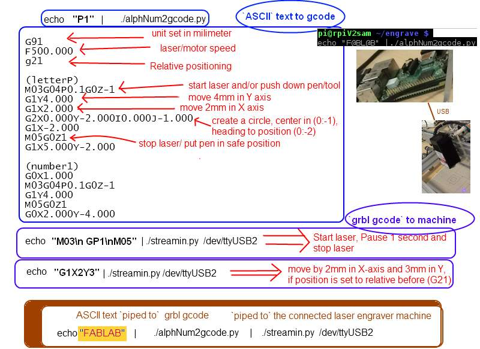

# engrave

Inspired from sream.py and simple_stream.py, we tuned it so that we could piped text from command line instead of using the provided software provided with the laser engraver.

We added a 'very basic home made font' using arc code G02 G03 if possible.
For more advanced text font/ picture to engrave, we prefere the use of inkscape.

``` shell
# code example
echo "F@BL@B$" |./alphNum2gcode.py |./streamin.py /dev/ttyUSB1 
echo -n "line1\nline2" |./alphNum2gcode.py |./streamin.py /dev/ttyUSB1 

```


``` shell
$ ./alphNum2gcode.py --help
usage: alphNum2gcode.py [-h] [-sx SX] [-sy SY] [-ss SS] [-ssy SSY] [-feed FEED]

echo "FOO_B@R" | alphNum2gcode.py generates gcode of the letters to be used with
the laser engrave machine

optional arguments:
  -h, --help  show this help message and exit
  -sx SX      sx scale, 1.0 if not specified
  -sy SY      sy scale = sx if not specified
  -ss SS      ss : spacing between char, default=2.0/sx
  -ssy SSY    newline space, default = ss
  -feed FEED  feed to gcode : F{feed} default 500
```




